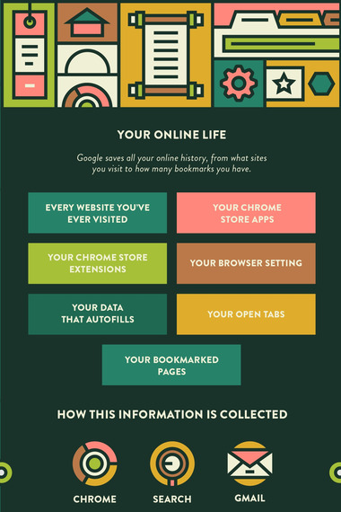

Privacy bit: How to flip it to 1

[](https://privacylx.org)

vasilis@privacylx.org

[PGP: 2DC1 FCEA FA18 E37D E871  EF41 5D23 7CAB ED63 7DDA](https://keys.openpgp.org/vks/v1/by-fingerprint/2DC1FCEAFA18E37DE871EF415D237CABED637DDA)

                    Disclaimer: Not a demo talk


## Identifying the problem

Privacy (and security) issues.

Come on, we 've heard this before!


*On average we read at least once daily about privacy issues and companies that
sold our precious private data.*


### Do you really know what's happening?

Why privacy matters (video)

[Source: La Quadrature du Net - "Reclaim Our Privacy"](https://www.invidio.us/watch?v=AW7aU3zv-4M) <!-- .element: class="attribution-small" -->

Note: La Quadrature du Net publishes "Reclaim Our Privacy", a three-minute
movie that explains the threat to, the importance of protecting, and the tools
to reclaim our privacy online.
Source: https://www.invidio.us/watch?v=AW7aU3zv-4M
Are you sure?


### Motivation of the selection

So many horrible services and companies!

Note: Inercia.pt website, Facebook event, Google form for registration that
requires to log in


[Source: MidEastPosts.com](http://mideastposts.com/wp-content/uploads/2011/05/BigBrother.jpg) <!-- .element: class="attribution-small" -->

Note: Internet privacy, such as use of a widespread "like" button on third-party
websites tracking users,[1][2] possible indefinite records of user
information,[3] automatic facial recognition software,[4][5] and its role in the
workplace, including employer-employee account disclosure.[6]
Source: https://en.wikipedia.org/wiki/Criticism_of_Facebook


[](https://web.archive.org/web/20160527122321/http://www.pcworld.com/article/199099/facebook_privacy_fixes.html)

[Source: Pcworld.com](https://web.archive.org/web/20160527122321/http://www.pcworld.com/article/199099/facebook_privacy_fixes.html) <!-- .element: class="attribution-small" -->


[](https://web.archive.org/web/20140322002901/https://www.extremetech.com/extreme/178777-facebooks-facial-recognition-software-is-now-as-accurate-as-the-human-brain-but-what-now)

[Source: Extermetech.com](https://web.archive.org/web/20140322002901/https://www.extremetech.com/extreme/178777-facebooks-facial-recognition-software-is-now-as-accurate-as-the-human-brain-but-what-now) <!-- .element: class="attribution-small" -->


[](https://www.nytimes.com/2008/02/11/technology/11facebook.html)

[Source: Nytimes.com](https://www.nytimes.com/2008/02/11/technology/11facebook.html) <!-- .element: class="attribution-small" -->


[](https://web.archive.org/web/20190913220539/https://www.cnbc.com/2019/08/13/facebook-hired-people-to-transcribe-voice-calls-made-on-messenger.html)

[Source: Cnbc.com](https://web.archive.org/web/20190913220539/https://www.cnbc.com/2019/08/13/facebook-hired-people-to-transcribe-voice-calls-made-on-messenger.html) <!-- .element: class="attribution-small" -->

Note: On August 13, 2019, it was revealed that the company had in fact enlisted
contractors to create and obtain transcripts of users, which were then analyzed
to help spread political messages.[46][47][48]
Source: https://en.wikipedia.org/wiki/Criticism_of_Facebook


#### Facebook is **not** your friend
* Cooperation with government requests
* Data mining
* Cambridge Analytica data scandal

Note: Government and local authorities rely on Facebook and other social
networks to investigate crimes and obtain evidence to help establish a crime,
provide location information, establish motives, prove and disprove alibis, and
reveal communications.
In 2018, Facebook admitted[146][147] that an app made by Global Science Research
and Alexandr Kogan, related to Cambridge Analytica, was able in 2014[148] to
harvest personal data of up to 87 million Facebook users without their consent,
by exploiting their friendship connection to the users who sold their data via
the app.[149]
Sources:
- https://en.wikipedia.org/wiki/Criticism_of_Facebook#Cooperation_with_government_requests
- https://en.wikipedia.org/wiki/Criticism_of_Facebook#Data_mining
- https://en.wikipedia.org/wiki/Criticism_of_Facebook#Facebook_and_Cambridge_Analytica_data_scandal


[](https://web.archive.org/web/20190302143109/https://www.theguardian.com/technology/2019/mar/02/facebook-global-lobbying-campaign-against-data-privacy-laws-investment)

[Source: Theguardian.com](https://web.archive.org/web/20190302143109/https://www.theguardian.com/technology/2019/mar/02/facebook-global-lobbying-campaign-against-data-privacy-laws-investment) <!-- .element: class="attribution-small" -->

Note: In early 2019, it was reported that Facebook had spent years lobbying
extensively against privacy protection laws around the world, such as the
General Data Protection Regulation (GDPR).[187] [188]
Source: https://en.wikipedia.org/wiki/Criticism_of_Facebook#International_lobbying_against_privacy_protections


[](https://web.archive.org/web/20190818232456/https://www.theguardian.com/technology/2019/mar/21/facebook-admits-passwords-unprotected)

[Source: Theguardian.com](https://web.archive.org/web/20190818232456/https://www.theguardian.com/technology/2019/mar/21/facebook-admits-passwords-unprotected) <!-- .element: class="attribution-small" -->

Note: In March 2019, Facebook admitted that it had mistakenly stored "hundreds of
millions" of passwords of Facebook and Instagram users in plaintext (as opposed
to being hashed and salted) on multiple internal systems accessible only to
Facebook engineers, dating as far back as 2012. Facebook stated that affected
users would be notified, but that there was no evidence that this data had been
abused or leaked.[189][190]
Source: https://en.wikipedia.org/wiki/Criticism_of_Facebook#Unencrypted_password_storage


[](https://archive.is/Nrrmr)

[Source: Techcrunch.com](https://archive.is/Nrrmr) <!-- .element: class="attribution-small" -->

Note: In April 2019, Facebook admitted that its subsidiary Instagram also stored
millions of unencrypted passwords.[191]


[](https://web.archive.org/web/20190818232444/https://www.mysanantonio.com/technology/businessinsider/article/Facebook-content-moderator-died-after-heart-attack-14018228.php)

[Source: Mysanantonio.com](https://web.archive.org/web/20190818232444/https://www.mysanantonio.com/technology/businessinsider/article/Facebook-content-moderator-died-after-heart-attack-14018228.php) <!-- .element: class="attribution-small" -->

Note: Content moderator Keith Utley, who was employed by Cognizant, experienced
a heart attack during work in March 2018; the office lacked a defibrillator, and
Utley was transported to a hospital where he died.[239][242]
Source: https://en.wikipedia.org/wiki/Criticism_of_Facebook#Moderators


[](https://web.archive.org/web/20191015061507/https://www.reuters.com/article/us-facebook-privacy-tracking/facebook-fuels-broad-privacy-debate-by-tracking-non-users-idUSKBN1HM0DR)

[Source: Reuters.com](https://web.archive.org/web/20191015061507/https://www.reuters.com/article/us-facebook-privacy-tracking/facebook-fuels-broad-privacy-debate-by-tracking-non-users-idUSKBN1HM0DR) <!-- .element: class="attribution-small" -->

Note: Facebook collects data from non-users.


[Source: Downtherabbitholemedia.com](http://www.downtherabbitholemedia.com/wp-content/uploads/2019/04/Google-800-x-450-800x445.jpg) <!-- .element: class="attribution-small" -->

Note: We can most probably have a weekend presentation only about the privacy
issues of Google. I will provide some pointers to understand the level of
atrocity.
Source: http://www.downtherabbitholemedia.com/wp-content/uploads/2019/04/Google-800-x-450-800x445.jpg


[Source: TheBestVPN.com - What Does Google Know About You: A Complete Guide](https://thebestvpn.com/what-does-google-know-about-you/) <!-- .element: class="attribution-small" -->


[Source: TheBestVPN.com - What Does Google Know About You: A Complete Guide](https://thebestvpn.com/what-does-google-know-about-you/) <!-- .element: class="attribution-small" -->


[Source: TheBestVPN.com - What Does Google Know About You: A Complete Guide](https://thebestvpn.com/what-does-google-know-about-you/) <!-- .element: class="attribution-small" -->


[Source: TheBestVPN.com - What Does Google Know About You: A Complete Guide](https://thebestvpn.com/what-does-google-know-about-you/) <!-- .element: class="attribution-small" -->


[Source: TheBestVPN.com - What Does Google Know About You: A Complete Guide](https://thebestvpn.com/what-does-google-know-about-you/) <!-- .element: class="attribution-small" -->


[Source: TheBestVPN.com - What Does Google Know About You: A Complete Guide](https://thebestvpn.com/what-does-google-know-about-you/) <!-- .element: class="attribution-small" -->




[Source: TheBestVPN.com - What Does Google Know About You: A Complete Guide](https://thebestvpn.com/what-does-google-know-about-you/) <!-- .element: class="attribution-small" -->


##### What's the danger?

* Political manipulation
* User discrimination
* Advertisements & Surveillance = ♥
* Centralization ate the cat :(


##### (meta)data

* Sell/hand over data to other companies, governments and authorities
* We can get killed based on metadata
* Data acquisition is toxic


#### Meanwhile in Portugal

```
O site a que pretende aceder encontra-se
bloqueado na sequência do cumprimento
de ordem judicial ou administrativa.

    http://mobilegen.vodafone.pt/denied/dn
```


[](https://explorer.ooni.org/measurement/20190918T003607Z_AS12353_voQgDsLHmjeV5F7OlfGQozwWlRtT5eyRzrDOeCmT7fH3GgyBAw?input=https://www.uber.com/)

[Source: OONI Explorer](https://explorer.ooni.org/measurement/20190918T003607Z_AS12353_voQgDsLHmjeV5F7OlfGQozwWlRtT5eyRzrDOeCmT7fH3GgyBAw?input=https://www.uber.com/) <!-- .element: class="attribution-small" -->

Note: OONI Explorer showing network blocking excerpt of Uber.com in Vodafone ISP
in Portugal


Note: In a neighbored country, Internet censorship expands.
A block page from the Spanish Civil Guard


[](https://web.archive.org/web/20171003115236/https://www.rt.com/news/405054-catalonia-google-independence-vote/)

[Source Rt.com](https://web.archive.org/web/20171003115236/https://www.rt.com/news/405054-catalonia-google-independence-vote/) <!-- .element: class="attribution-small" -->


### GitHub government takedown (Spain)

Tsunami Democratic app and other git repos


```diff
commit 983f257e63903280bf2f306da45bf467e7bc6f3c
Author: Hubot <hubot@github.com>
Date:   Tue Oct 29 17:08:49 2019 -0400

    Publish notice.

diff --git a/Spain/2019/2019-10-23-GuardiaCivil.md b/Spain/2019/2019-10-23-GuardiaCivil.md
new file mode 100644
index 0000000..6bccde1
--- /dev/null
+++ b/Spain/2019/2019-10-23-GuardiaCivil.md
@@ -0,0 +1,29 @@
+Dear Sir or Madam,
+
+This is the official e-mail account of the Lawful Interception Unit of the Guardia Civilwhich is one of the Spanish Law Enforcement Agencies. Since 1999, our unit has been working as the Guardia Civil's Single Point of Contact with Internet Service Providers and every other Online Service Provider that uses the telecommunication network in order to provide any service. Our main task is to request them important information or any other action regarding judicial investigations carried out by our investigation teams.
+
+In Spain, judicial authorities are responsible for the supervision and control of websites in order to prevent the dissemination of criminal content as it is specified in the article 35 of our Law 34/2002 and the article 13 of our Criminal Procedure Code.
+
+As you may have seen in the international media, Spain is currently facing a series of riots involving serious public disorder and main infrastructure's sabotage. There is an ongoing investigation being carried out by the National High Court where the movement Tsunami Democratic has been confirmed as a criminal organization driving people to commit terrorist attacks. Tsunami Democratic's main goal is coordinating these riots and terrorist actions by using any possible mean.
+
+Among them, they have developed an app that provides information about those riots and allows their users to communicate between themselves in order to coordinate those actions. This app has been uploaded in GitHub by the user [private] ([private]), where people that want to participate in riots can access his repository ([private]) and install different versions of this app in their devices. Moreover, other repositories with the same information have been created to prevent the content being withheld.
+
+Concerning this situation, and in compliance with the Law, we send this e-mail with a national court warrant attached in order to request both withholding the content and data related to the aforementioned investigation. This is the same procedure that we follow with other service providers located in the United States, such as Microsoft or Google.
+
+Yours faithfully,
+
+------------------------------------------------------------------------------------------
+
+Estimado señor o señora,
+
+Esta es la cuenta de correo electrónico oficial del Grupo de Interceptación de las Telecomunicaciones de la Guardia Civil, que es una de las agencias policiales españolas. Desde 1999, nuestra unidad ha estado trabajando como Punto de contacto único de la Guardia Civil con proveedores de servicios de Internet y cualquier otro proveedor de servicios en línea que utiliza la red de telecomunicaciones para proporcionar cualquier servicio. Nuestra tarea principal es solicitarles información importante o realizar cualquier otra acción relacionada con las investigaciones judiciales llevadas a cabo por nuestros equipos de investigación.
+
+En España, las autoridades judiciales son responsables de la supervisión y el control de los sitios web con el fin de evitar la difusión del contenido delictivo, tal como se especifica en el artículo 35 de nuestra Ley 34/2002 y el artículo 13 de nuestro Código de Procedimiento Penal.
+
+Como puede haber visto en los medios internacionales, España se enfrenta actualmente a una serie de disturbios violentos que involucran graves desórdenes públicos y el sabotaje de infraestructuras críticas. La Audiencia Nacional está llevando a cabo una investigación en la que el movimiento Tsunami Democratic ha sido confirmado como una organización criminal que impulsa la comisión de ataques terroristas. El objetivo principal de Tsunami Democratic es coordinar estos disturbios y acciones terroristas usando cualquier medio posible.
+
+Entre ellos, han desarrollado una aplicación que proporciona información sobre esos disturbios y permite a sus usuarios comunicarse entre ellos para coordinar esas acciones. Esta aplicación ha sido cargada en GitHub por el usuario [private] ([private]), donde las personas que desean participar en disturbios pueden acceder a su repositorio ([private]) e instale diferentes versiones de esta aplicación en sus dispositivos. Además, se han creado otros repositorios con la misma información para evitar que el contenido se retenga.
+
+Con respecto a esta situación, y de conformidad con la Ley, enviamos este correo electrónico con una orden judicial nacional adjunta para solicitar la retención del contenido y los datos relacionados con la investigación antes mencionada. Este es el mismo procedimiento que seguimos con otros proveedores de servicios ubicados en los Estados Unidos, como Microsoft o Google.
+
+Atentamente,
```
[Source: GitHub](https://web.archive.org/web/20191029224644/https://github.com/github/gov-takedowns/blob/master/Spain/2019/2019-10-23-GuardiaCivil.md) <!-- .element: class="attribution-small" -->


##### We ~~need~~ have alternatives


[Source: Framasoft](https://framasoft.org/img/Peha-Banquet-CC-By-1920.jpg) <!-- .element: class="attribution-small" -->

Note: Degooglify your Internet find **user**-friendly tools.


[](https://privacylx.org/community/)


##### Thank you!

Participate/find more info:

[https://privacylx.org/community/](https://privacylx.org/community/)
